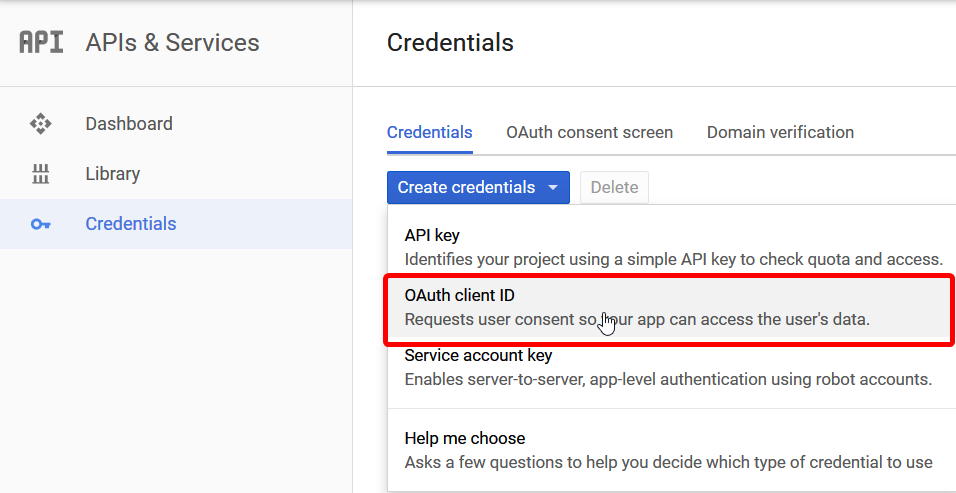
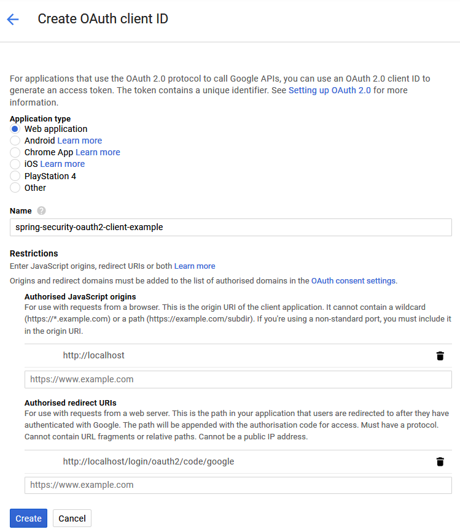

# spring-security-oauth2-client-example

## Modules

### minimal-sample

This module contains the minimal configuration required for a Spring Boot project using Spring Security with OAuth2 client. 


### custom-userservice-sample

Same as minimal-sample, but it contains a custom OAuth2 UserService.


## Note

For Google, it's actually possible to just use the two following properties:

```properties
spring.security.oauth2.client.registration.google.client-id=
spring.security.oauth2.client.registration.google.client-secret=
```

But for the sake of the example, I'll be inserting all properties.


# Creating the API credentials

- Navigate to [Google's Developer console](https://console.developers.google.com/apis/credentials/)
- Create credentials > OAuth client ID



- Select **Web Application**
- Add `http://localhost` as  Authorised JavaScript origins
- Add `http://localhost/login/oauth2/code/google` as  Authorised redirect URIs



- Click on **Create**
- Copy your client ID and your client secret as the value for 
`spring.security.oauth2.client.registration.google.client-id` and
`spring.security.oauth2.client.registration.google.client-secret` respectively in the `application.properties` file.
- Done
